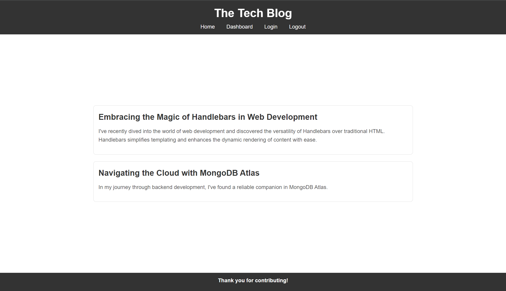

# Juniper's Tech Blog

## Description

Juniper's Tech Blog is a dynamic platform for sharing and discussing the latest technology trends, tutorials, and insights. This blog allows users to create, update, and delete posts. Its a great place for users to share their thoughts on various tech-related topics.

## Features

- **User Authentication**: Secure login and registration system for users.
- **Post Management**: Users can create, edit, and delete their posts.
- **Responsive Design**: Ensures a seamless experience across various devices.

## Installation and Usage 
 You can visit, exlpore and contrubute by visiting [https://juniperstechblog-69076c68fe28.herokuapp.com/](https://juniperstechblog-69076c68fe28.herokuapp.com/). 

## License

Distributed under the MIT License. See `LICENSE` for more information.

## Contact
For any questions, please contact me on GitHub at [JuniperWrenMcGill](https://github.com/JuniperWrenMcGill) 
